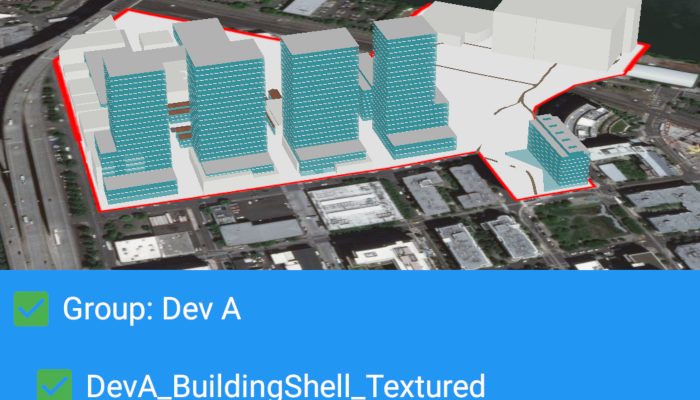

# Group layers

Group a collection of layers together and toggle their visibility as a group.

## Use case  

Group layers communicate to the user that layers are related and can be managed together.

In a land development project, you might group layers according to the phase of development.

## How to use the sample

Display the layers in the map in a table of contents by clicking the map icon at the top right. Toggle the checkbox next to a layer's name to change its visibility. Turning a group layer's visibility off will override the visibility of its child layers.

## How it works

1. Add the `GroupLayer` and additional `Layer`s as operational layers in the `SceneView`.
3. To build the table of contents:
  - Add each layer to the table of contents.
  - For each `Layer` in the `SceneView`, if `canShowInLegend()` returns true, add it to the table of contents.
4. To toggle the visibility of the group, simply change the group layer's visibility property.

## Relevant API

* GroupLayer

## Additional information

The full extent of a group layer may change when child layers are added/removed. Group layers do not have a spatial reference, but the full extent will have the spatial reference of the first child layer.

Group layers can be saved to web scenes. In web maps, group layers will be ignored.

## Tags

group layer, layers