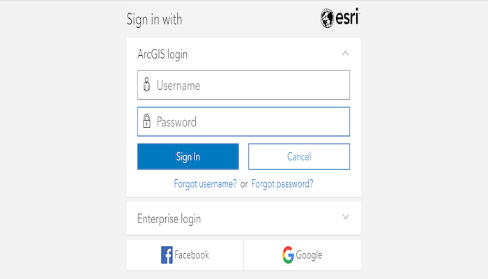

# Authenticate with OAuth
This sample demonstrates how to authenticate with ArcGIS Online (or your own portal) using OAuth2 to access secured resources (such as private web maps or layers). Accessing secured items requires a login on the portal that hosts them (an ArcGIS Online account, for example).

This sample utilizes custom `AuthenticationChallengeHandler` where user handles the prompting of Authentication Challenges themselves compared to the [`DefaultAuthenticationChallengeHandler`](http://android.esri.com:8080/docs/arcgis-android/publicAPIRelease/WebJavadoc/com/esri/arcgisruntime/security/DefaultAuthenticationChallengeHandler.html) where the ArcGISRuntime handles prompting of the Authentication Challenges.

This sample utilizes the system installed web browser to prompt the user with an [`OAUTH_CREDENTIAL_CHALLENGE`](http://android.esri.com:8080/docs/arcgis-android/publicAPIRelease/WebJavadoc/com/esri/arcgisruntime/security/AuthenticationChallenge.Type.html#OAUTH_CREDENTIAL_CHALLENGE) and includes use of the `WebView` as a fallback mechanism if the user does not have a web browser installed, only to allow the user to use this sample in all circumstances. We do not recommend using `WebView` as part of your OAuth flow as per [IETF's recommendations](https://tools.ietf.org/html/rfc8252).

## Use case
Your app may need to access items that are only shared with authorized users. For example, your organization may host private data layers or feature services that are only accessible by verified users. You may also need to take advantage of premium ArcGIS Online services, such as geocoding or routing, that require a named user login.

## How to use the sample
1. Before you run the sample, specify your OAuth configuration along with the portal to login to and the webmap id in strings.xml.
   - http://android.esri.com:8080/docs/arcgis-android/publicAPIRelease/com/esri/arcgisruntime/security/OAuthConfiguration.html
   - https://developers.arcgis.com/labs/android/access-services-with-oauth-2/
   - https://developers.arcgis.com/documentation/core-concepts/security-and-authentication/mobile-and-native-user-logins/
1. Once you launch the app, you will be challenged for an ArcGIS Online login to view the private layers.
1. Enter a user name and password for an ArcGIS Online named user account (such as your ArcGIS for Developers account).
1. If you authenticate successfully, the private layers will display in the map.

## How it works
1. When the app loads, a web map containing premium content (world traffic service) is attempted to be loaded in the map view.
1. In response to the attempt to access secured content, an OAUTH_CREDENTIAL_CHALLENGE is issued and it is handled in the handleChallenge() by opening the OAuth authentication page from ArcGIS Online in the web browser installed on the device or in the web view (in the absence of the web browser).
1. If the user authenticates successfully, the private layers will display in the map.

## WebView
Please note that we have chosen to include use of the `WebView` as a fallback mechanism if the user does not have a web browser installed, only as a matter of course to allow you to use this sample in all circumstances.
We do not recommend using `WebView` as part of your OAuth flow as per IEFT's recommendations: https://tools.ietf.org/html/rfc8252

## Relevant API
 * AuthenticationManager
 * AuthenticationChallengeHandler
 * OAuthConfiguration
 * ArcGISPortal
 * Credential

#### Tags
Cloud & Portal
Authentication
Security
OAuth