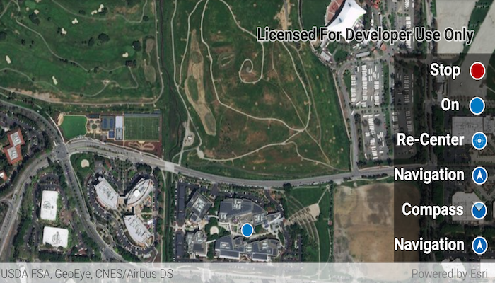

# Display device location

Display your current position on the map, as well as switch between different types of auto pan modes.

## Use case

When using a map within a GIS, it may be helpful for a user to know their own location within a map, whether that's to aid the user's navigation or to provide an easy means of identifying/collecting geospatial information at their location.

## How to use the sample

Tap the button in the lower right (which starts in Stop mode). A menu will appear with the following options:

* Stop - Stops the location display.
* On - Starts the location display with no `AutoPanMode` mode set.
* Re-Center - Starts the location display with `AutoPanMode` set to `RECENTER`.
* Navigation - Starts the location display with `AutoPanMode` set to `NAVIGATION`.
* Compass - Starts the location display with `AutoPanMode` set to `COMPASS_NAVIGATION`.

## How it works

1. Create a `MapView`.
1. Get the `LocationDisplay` from the `MapView` with `mapView.locationDisplay`.
1. Use `startAsync()` and `stop()` on the `LocationDisplay` as necessary.

## Relevant API

* ArcGISMap
* LocationDisplay
* MapView

## Additional information

Location permissions are required for this sample.

This sample demonstrates the following `AutoPanMode` options:

* RECENTER: In this mode, the MapView attempts to keep the location symbol on-screen by re-centering the location symbol when the symbol moves outside a "wander extent". The location symbol may move freely within the wander extent, but as soon as the symbol exits the wander extent, the MapView re-centers the map on the symbol.

* NAVIGATION: This mode is best suited for in-vehicle navigation.

* COMPASS_NAVIGATION: This mode is better suited for waypoint navigation when the user is walking.

## Tags

compass, GPS, location, map, mobile, navigation
